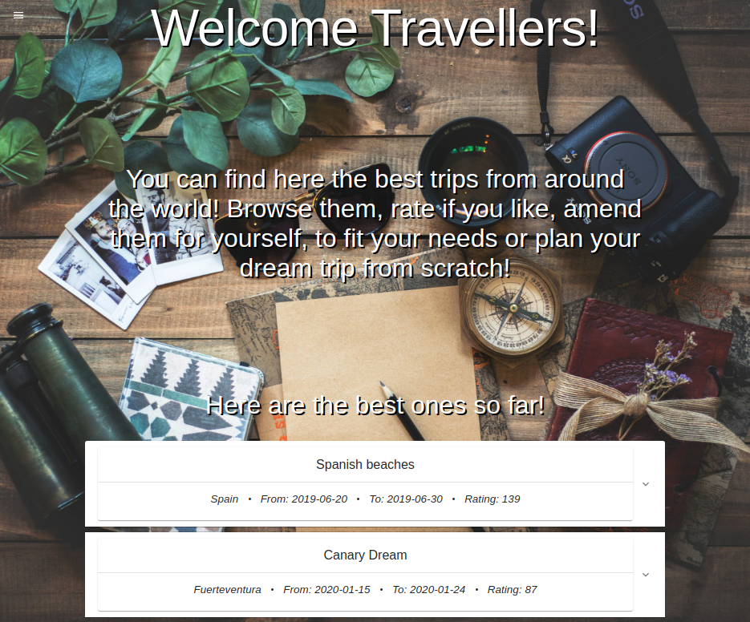

# MyWay Travel Community App

Create, find or share your trips. Get ideas from others, or plan your dream one.

In this app you can save/share/plan your trips including daily activites with costs,
to see how much you spent or will spend, to help planning.

## Features:

- See recommended trips by ratings on main page
- Register new user
- Login/logout
- Create your own trip(on selected dates)
- Check trips that are in progress or will be in the future
- Separate page to see trips from past
- Admin page to manage users

## Technologies Used

- Java
- Spring Boot
- Spring Security using JWT
- Zuul gateway
- Eureka Server
- Microservices
- H2 database
- React.js(Material-UI)
- Teamviewer

## Project / status

This is a project, we, a team of 3 junior software developers created from scratch, to learn 
Spring Boot, Spring Security, Microservices.

Mostly we used pair programming with Teamviewer, on one shared host, so commits does not show real data.
Project contribution was evenly spread among us.

We focused less on the planned features to make sure all of us understand what we have to
learn here.

Unfinished features from plans: 
- Rating system 70%
- Copy a trip to make our own plan from it 70%
- Admin page 80%

We spent 4 weeks to build this app:
- 1st sprint: build project basics in one big Monolith
- 2nd sprint: adding security with JWT
- 3rd & 4th sprint: recreating/separating the whole app to Microservices (this took longer then expected,
 therefore some of the features were not implemented yet, to focus instead on understanding the concept, 
 and to make it work without bugs)

## Outcome

As a result, we can say that we managed to learn and understand:
- How to work in Spring framework
- How to use Microservices
- How to implement JWT token based security in a Gateway Service
- How to communicate with a React frontend(using tokens)

#### [Frontend Github Repository ](https://github.com/kadartibi/myway-frontend)

## Project Demo

